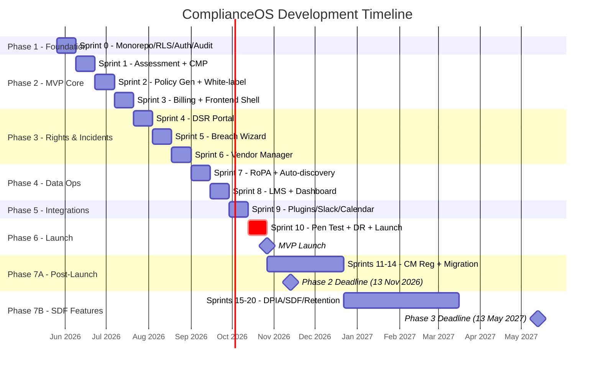
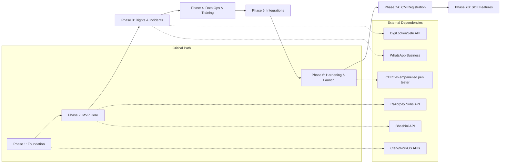

# ComplianceOS v1.0 — Master Implementation Plan

> **Mission:** Build India's operating system for DPDP Act 2023 compliance — multi-tenant, white-label, audit-grade.
> **Timeline:** MVP Aug 2026 · Phase 2 Nov 2026 · Full Suite May 2027

---

## Regulatory Timeline — Hard Deadlines

| Date | DPDP Milestone | ComplianceOS Must Ship |
|---|---|---|
| **Aug 2026** | Pre-enforcement window | MVP: Assessment, CMP, Policy Gen, Billing, White-label |
| **13 Nov 2026** | Phase 2 — CM registration opens | DSR Portal, Breach Wizard, Vendor Manager, CM-mode relay |
| **13 May 2027** | Phase 3 — Full compliance | SDF modules, DPIA, Retention engine, all 23 rules covered |

---

## Architecture Decisions (Locked)

| Decision | Choice | Rationale |
|---|---|---|
| Frontend | Next.js 15 App Router + Tailwind 4 + shadcn/ui | RSC perf; India CDN via Cloudflare |
| API | Fastify + tRPC (admin) + REST OpenAPI 3.1 (public) | Type-safe internal; standards-compliant external |
| DB | PostgreSQL 16 RDS Multi-AZ + RLS | Shared schema; `SET app.current_tenant` per request |
| Auth | Clerk (end-user MFA/passkeys) + WorkOS (enterprise SSO/SAML) | Indian MFA + SCIM |
| Queue | BullMQ + Redis 7 ElastiCache | Breach timers, retention crons, scans |
| AI | Claude Sonnet 4.5 → GPT-4.1 fallback via AI Gateway | Presidio PII redaction layer |
| Billing | Razorpay Subs + UPI Autopay | Only viable Indian recurring stack |
| Hosting | AWS ap-south-1 (Mumbai) + ap-south-2 (Hyderabad DR) | Data residency compliance |
| Monorepo | Turborepo | Shared packages: web, SDK, workers, rules-engine |
| ORM | Drizzle Kit | Type-safe, migration-friendly, `rule_ref` tags |
| i18n | next-intl + Bhashini APIs | 22 scheduled languages + English |
| Observability | OpenTelemetry → Grafana Cloud + Sentry | Traces, metrics, error tracking |

---

## Phase 1: Foundation (Sprint 0 — Weeks 1–2)

### Objective
Monorepo scaffold, Postgres RLS tenant isolation, auth, tamper-evident audit trail, CI/CD pipeline.

### Deliverables

**1.1 Monorepo & Tooling**
- Turborepo with structure: `apps/web`, `apps/banner-sdk`, `apps/mobile`, `packages/db`, `packages/config`, `packages/rules-engine`, `packages/policy-templates`, `packages/workers`
- TypeScript 5.4, ESLint flat config, Prettier
- Docker Compose: Postgres 16, Redis 7, MinIO (S3 mock)
- GitHub Actions CI: lint → typecheck → test → build → deploy (ECS Fargate)
- Terraform modules: RDS, ElastiCache, S3, ECS, KMS, VPC

**1.2 Database Foundation**
- Core tables: `platform_admins`, `agencies`, `tenants`, `users`, `roles`, `permissions`, `role_permissions`, `memberships`
- RLS policies on ALL tenant-scoped tables
- Non-superuser `app_role`; middleware calls `SET app.current_tenant` before every query
- Drizzle migration pipeline; every migration tagged with `rule_ref`
- Seed scripts for dev/test

**1.3 Auth & Tenant Resolution**
- Clerk integration (signup, login, MFA, passkeys)
- WorkOS integration (SAML/OIDC for enterprise SSO)
- Subdomain → `tenant_id` resolver middleware
- JWT validation: extract `sub`, `tenant_id`, `agency_id`, `role`, `scopes`
- Resolution order: subdomain → `X-Tenant-Id` → JWT claim

**1.4 Tamper-Evident Audit Trail**
- `audit_logs` table with HMAC-SHA256 chained hash
- `REVOKE UPDATE, DELETE ON audit_logs FROM PUBLIC`
- BullMQ worker: daily Merkle root → `audit_anchors` table
- OpenTimestamps anchoring (stub initially)
- CLI verifier tool

**1.5 RBAC/ABAC Authorization**
- Casbin policy engine with 8 roles: `platform_admin`, `agency_owner`, `agency_admin`, `consultant`, `client_admin`, `client_dpo`, `client_user`, `data_principal`
- ABAC attributes: `tenant_id`, `agency_id`, `module_scope`, `data_classification`

### Acceptance Criteria
- ✅ Integration test: Tenant A query returns 0 rows for Tenant B data
- ✅ Forged `X-Tenant-Id` header → 0 rows + `severity=high` audit log entry
- ✅ Audit hash chain verifies end-to-end via CLI
- ✅ CI pipeline green on every PR merge

---

## Phase 2: MVP Core (Sprints 1–3 — Weeks 3–8)

### Objective
First paying customer: Assessment → CMP Banner → Policy Gen → Billing → White-label basics.

### Deliverables

**2.1 Readiness Assessment (Module 1)**
- ~60 question bank (JSONB, versioned) across consent/security/retention/children/vendors/breach/SDF
- Rule-weighted scoring (Rule 6 × ₹250cr penalty cap = highest weight)
- Industry packs: e-com, fintech, edtech, healthtech, gaming, SaaS, logistics
- 0–100 score + gap heatmap + 90-day remediation plan
- PDF + JSON export; resumable & collaborative
- AI: explain-this per question; draft-remediation per gap

**2.2 Consent Management Platform (Module 3)**
- **Banner SDK** (`@complianceos/banner`): vanilla JS ≤5KB gz via esbuild
  - API: `init()`, `open()`, `withdraw()`, `status()`
  - IAB TCF v2.3 (with `disclosedVendor` segment), Google Consent Mode v2, GPC
  - Equal-weight Accept/Reject; 22 languages via Bhashini
  - MutationObserver suppresses trackers pre-consent
- **Preference Centre** at `/privacy`: purpose toggles, one-click withdraw
- **Consent Records**: SHA-256 hash chain in `consent_logs`
- Cookie auto-scanner (nightly Puppeteer); offline POS/CSR API
- AI: notice-clarity scorer, dark-pattern lint

**2.3 Policy & Document Generator (Module 7 — Partial)**
- Rule-3 Privacy Notice (EN + HI); Cookie Policy template
- Template engine with tenant RoPA data injection
- Mandatory "Auto-generated · Lawyer review recommended" banner
- Version control with diff view
- AI: generate from RoPA + template; flag unusual clauses

**2.4 White-Label Basics (Module 10 — Partial)**
- Theme builder: CSS variables (logo, palette, favicon)
- Custom domain CNAME + ACM cert provisioning
- Agency → Client hierarchy; client invite flow
- SES sender domain per agency (SPF/DKIM/DMARC)

**2.5 Billing & Subscriptions**
- Razorpay Subscriptions + UPI Autopay mandate
- Tiers: Free, Starter (₹4,999), Growth (₹14,999), Business (₹49,999), Enterprise (₹2L+), Agency (₹19,999 + ₹999/client)
- Indian GST invoicing (18%); webhook handlers for payment lifecycle

**2.6 Frontend Shell**
- App Router groups: `(marketing)`, `(platform)`, `(agency)`, `(dpo)`, `(public)`
- shadcn/ui + TanStack Query + Zustand
- Responsive mobile-first; dark mode; WCAG 2.2 AA on public surfaces

### Acceptance Criteria
- ✅ Customer signs up → configures banner → publishes Rule-3 notice in Hindi → UPI Autopay completes first debit
- ✅ Banner SDK cold-load <50ms p95 from Mumbai; ≤5KB gzipped
- ✅ Consent record hash chain validates
- ✅ White-label subdomain serves agency-branded UI

---

## Phase 3: Rights & Incident Response (Sprints 4–6 — Weeks 9–14)

### Objective
DSR portal with 90-day SLA, Breach Wizard with dual-clock (6h CERT-In / 72h DPB), Vendor Risk Manager.

### Deliverables

**3.1 DSR Portal (Module 4)**
- Public at `privacy.{client-domain}` — no marketing chrome
- Auth: email OTP, mobile OTP, DigiLocker XML (Setu), video-KYC (high-risk)
- Request types: access, correction, erasure, nomination, grievance, withdrawal
- 90-day SLA timer (Rule 14(3)): alerts at T-30/T-10/T-1; auto-escalate at T=0 → `grievance_overdue`
- Response packet auto-assembled from RoPA; nomination per Sec 14
- Status via email + WhatsApp Business
- AI: classify free-text → right type; redact third-party PII in access exports

**3.2 Breach Notification Wizard (Module 5)**
- Dual-clock timers (IST): CERT-In 6h + DPB 72h from detection
- Auto-severity scoring + classification (ransomware/BEC/misconfig/insider)
- Report generators: CERT-In Annexure-I PDF, DPB initial + 72h detailed, Data Principal notices
- Evidence locker: S3 Object Lock (Compliance Mode, 7yr)
- Sectoral overlays: RBI 2h/6h, IRDAI, TRAI
- BullMQ timer alert jobs
- AI: severity classifier, draft narrative, root-cause hypothesis

**3.3 Vendor Risk Manager (Module 6)**
- Vendor register + DPA generator (DPDP-aligned clauses)
- Inherent + residual risk scoring; SBOM upload
- SOC 2/ISO 27001 cert tracker + expiry alerts
- Rule 15 negative-list watcher; SDF traffic-data flag (Rule 13(4))
- AI: parse SOC 2 → control gaps; summarize vendor privacy policy

**3.4 WhatsApp & SMS Integration**
- WhatsApp Business approved sender; TRAI-DLT registered SMS headers
- Templates: DSR status, breach alerts, consent reminders

### Acceptance Criteria
- ✅ Breach drill → CERT-In + DPB filings produced within IST bounds
- ✅ DSR portal at `privacy.{client}.in` with DigiLocker auth working
- ✅ SLA webhooks fire at T-30/T-10/T-1; escalation at T=0
- ✅ DPA generated with all DPDP-required clauses
- ✅ Evidence stored with S3 Object Lock verified

---

## Phase 4: Data Ops & Training (Sprints 7–8 — Weeks 15–18)

### Objective
RoPA with auto-discovery agents, LMS, Dashboard with agency aggregation.

### Deliverables

**4.1 Data Inventory & RoPA (Module 2)**
- `processing_activities`, `data_assets`, `data_flows` CRUD
- CSV/Excel bulk import
- Auto-discovery: Postgres/MySQL/MongoDB sniffer, S3 scanner, Tally API, Zoho Books connector
- React Flow data-flow visualizer; change history with diff
- Rule 8 retention engine: 48h pre-deletion notices; cross-border checker (Rule 15)
- AI: free-text → RoPA rows; suggest retention from Third Schedule

**4.2 Compliance Training LMS (Module 8)**
- SCORM-compatible player; quiz engine; certificate PDFs with verification URL
- 22-language scripts via Bhashini TTS
- Packs: DPDP basics, engineering deep-dive, sectoral
- 12-month auto-refresher; agency-level customization

**4.3 Dashboard & Reporting (Module 9)**
- Widgets: compliance score, open DSRs, breach timeline, consent rates, vendor risk, training %
- Agency aggregation across ≥10 client tenants
- Weekly/monthly auto-emails (BullMQ); CSV/PDF export; per-tenant API

### Acceptance Criteria
- ✅ Agency owner sees aggregated risk across ≥10 client tenants
- ✅ Tally import creates valid RoPA entries
- ✅ LMS certificate verifiable at public URL
- ✅ Dashboard <2s load with 10 widgets

---

## Phase 5: Integrations & Ecosystem (Sprint 9 — Weeks 19–20)

### Objective
CMS plugins, Slack/Teams, calendar integrations, onboarding wizard, sandbox.

### Deliverables
- **CMS Plugins**: WordPress, Shopify, WooCommerce (consent banner + DSR widget)
- **Comms**: Slack app + MS Teams connector (breach alerts, DSR reminders)
- **Calendar**: Google + Outlook — statutory deadline events
- **Email**: SES SPF/DKIM/DMARC per agency; SNS bounce/complaint handling
- **Onboarding Wizard**: industry start-packs (e-com, healthtech, edtech, fintech, gaming, SaaS, logistics)
- **Sandbox**: `*.sandbox.complianceos.in` with seed data
- **In-app Chat + KB**: Intercom-style widget; consultant roster with availability

### Acceptance Criteria
- ✅ WordPress plugin installs and shows consent banner
- ✅ Slack breach alert fires <60s after incident creation
- ✅ Calendar events auto-created for statutory deadlines

---

## Phase 6: Hardening & Launch (Sprint 10 — Weeks 21–22)

### Objective
Pen test, DR drill, SOC 2, performance validation → **🚀 MVP Launch Aug 2026**.

### Deliverables

**6.1 Security**
- External pen test (CERT-In empanelled): OWASP Top 10, API Top 10, mobile SDK, banner XSS, cross-tenant
- AWS GuardDuty + Security Hub; Secrets Manager 90-day rotation
- Rate limiting per API-key per tenant + overage billing
- 2FA enforcement for admin roles

**6.2 Disaster Recovery**
- DR drill: failover to ap-south-2; validate RTO 4h / RPO 15min
- S3 CRR verification; PG read replica promotion test

**6.3 Own Compliance**
- ComplianceOS Rule 3 notice + DSR portal for own users
- Internal CERT-In 6h + DPB 72h playbook; quarterly tabletop
- Vendor register for own processors (AWS, Clerk, WorkOS, Razorpay, Anthropic, OpenAI, Bhashini)
- SOC 2 Type I evidence; ISO 27001 → DPDP cross-map

**6.4 Performance**
- Banner cold-load <50ms p95 (Mumbai/BLR/DEL/CHN/KOL)
- FCP <1.5s on 3G (simulated Patna); p95 API <250ms Mumbai
- Load test: 10K concurrent consents/min

**6.5 Launch Assets**
- DPDP Certified trust badge (`trust.complianceos.in/{slug}`)
- Compliance Score API (read-only, tenant-granted scope)
- Marketing site + documentation site

### Acceptance Criteria — **🚀 MVP LAUNCH AUG 2026**
- ✅ Pen test: no critical/high findings
- ✅ DR failover within RTO/RPO
- ✅ All performance benchmarks met
- ✅ SOC 2 Type I evidence packaged

---

## Phase 7: Post-Launch (Sprints 11–20 — Weeks 23–42)

### 7A: Phase 2 Enforcement (Sprints 11–14, Sep–Nov 2026)
- Consent Manager registration pack + CM-mode relay toggle
- OneTrust / Consentin / Privy migration scripts
- Mobile consultant app (Expo): case board, breach pager, biometric unlock
- Browser extension: ComplianceOS Inspector for audits
- Legal-template marketplace with revenue share + ratings
- Referral/affiliate program via Razorpay Payouts
- Child consent: DigiLocker age-token + parent OTP fallback (7yr retention)

### 7B: SDF & Full Compliance (Sprints 15–20, Dec 2026–May 2027)
- **DPIA Workflow**: risk + mitigation registers, residual-risk sign-off, annual SDF schedule, auto-trigger on sensitive categories
- **SDF Modules**: algorithmic-due-diligence register, DPO workspace (unified inbox, statutory calendar), annual audit workflow, Rule 13(4) traffic-data proofs, regulator dashboards
- **Retention Automation**: per-purpose cron workers, 48h pre-delete notices (Rule 8), 3yr rule for ≥2cr-user platforms
- **Government Access Register** (Rule 23): non-disclosure flag, legal-counsel approval gate
- **AI Regulatory Monitor**: daily crawl MeitY/PIB/DPBI/RBI/SEBI/IRDAI/CERT-In → diff → "Stale Policy" alerts
- **Cross-border Register**: Rule 15 negative-list integration
- **Cyber-insurance Partnership**: pre-filled quotes from RoPA + breach history
- **AI Risk Detector**: headless-browser weekly crawl → dark-pattern/compliance violation flags

---

## Sprint Gantt Overview

---

## Module × Phase Delivery Matrix

| Module | Phase 2 (MVP) | Phase 3 | Phase 4 | Phase 5 | Phase 6 | Phase 7 |
|---|---|---|---|---|---|---|
| 1. Assessment | ✅ Full | | | | | |
| 2. RoPA + DPIA | | | ✅ RoPA | | | ✅ DPIA |
| 3. CMP | ✅ Full | | | | | CM-mode |
| 4. DSR Portal | | ✅ Full | | | | |
| 5. Breach Wizard | | ✅ Full | | | | |
| 6. Vendor Manager | | ✅ Full | | | | |
| 7. Policy Gen | Partial | | | | | Marketplace |
| 8. LMS | | | ✅ Full | | | |
| 9. Dashboard | | | ✅ Full | | | SDF views |
| 10. White-label | Partial | | | | | Mobile app |

---

## Risk Register

| Risk | Impact | Probability | Mitigation |
|---|---|---|---|
| DPBI portal launches API before May 2027 | Medium | Low | Architecture supports API plug-in; PDF fallback |
| MeitY compresses timeline to 12 months | High | Medium | Pull Phase 3 to Sprint 7–8; defer LMS polish |
| Bhashini API downtime/quality | Medium | Medium | Vendored static translations for top 5 langs |
| DigiLocker age-token not live by May 2027 | Medium | High | Parent mobile-OTP + ID-doc attestation fallback |
| RLS bypass vulnerability | Critical | Low | Integration tests on every PR; pen test; never superuser |
| Razorpay UPI Autopay mandate failures | Medium | Medium | HDFC/ICICI gateway switch as fallback |
| Team capacity bottleneck | High | High | Phased delivery; agency tier first; defer SDF |

---

## Recommended Team Structure

| Role | Count | Phases |
|---|---|---|
| Full-stack Lead (you) | 1 | All |
| Backend Engineer | 1–2 | Phase 1 onward |
| Frontend Engineer | 1 | Phase 2 onward |
| DevOps / Infra | 1 (part-time) | Phase 1, 6 |
| Legal / Compliance Advisor | 1 (contractor) | Phase 2 onward (template review) |
| QA / Security | 1 | Phase 3 onward |

---

## Dependency Map

---

## Open Decisions for Your Input

> [!IMPORTANT]
> **1. Hosting Strategy:** Start on Railway/Render for Sprints 0–3 (faster iteration), then migrate to AWS ECS for launch? Or go AWS from day one?

> [!IMPORTANT]
> **2. Team Size:** Solo build for Sprint 0, or do you have a team? Affects parallelization.

> [!IMPORTANT]
> **3. Agency vs SME Priority:** Build agency/consultant tier first (higher ARPU, stickier), or ship basic SME self-serve simultaneously?

> [!IMPORTANT]
> **4. AI Models for Dev:** Use lighter models (Haiku/GPT-4.1-mini) for dev/staging to control costs?

> [!IMPORTANT]
> **5. Legal Review:** Do you have counsel for template review, or ship with "DRAFT — Legal review required" banners?

> [!IMPORTANT]
> **6. Start Point:** Ready to begin Sprint 0 (monorepo + RLS + auth + audit trail) immediately?
